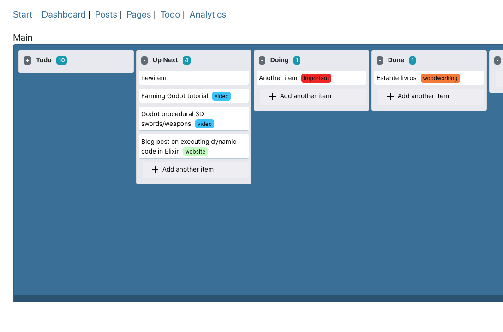

# live_view_trello_clone
A Phoenix LiveView Trello "clone". It contains a small subset of Trello, mostly for training and learning purposes. 

Currently supports:
- Item drag and drop
- List drag and drop (ordering)
- Adding boards, lists, items
- Labelling items with coloured tags
- Realtime updates via PubSub

Mandatory screenshot:



Notes:
- It's not a full Phoenix app, but it should be easy to adapt to a new one. 
- There are some helpers (like pagination, date formatting, etc) that are not part of this codebase.
- The code is not up to date with Phoenix Live Controller 0.6 (yet), which uses the new @event_handler callbacks.

Example routing:

```
    scope "/todo", Todo do
      live "/boards/new", Board.CreateView
      live "/boards/:id/edit", Board.EditView, id: :id
      live "/boards/:id", Board.ShowView, id: :id
      live "/", Board.IndexView
    end
```

MIT Licence.
